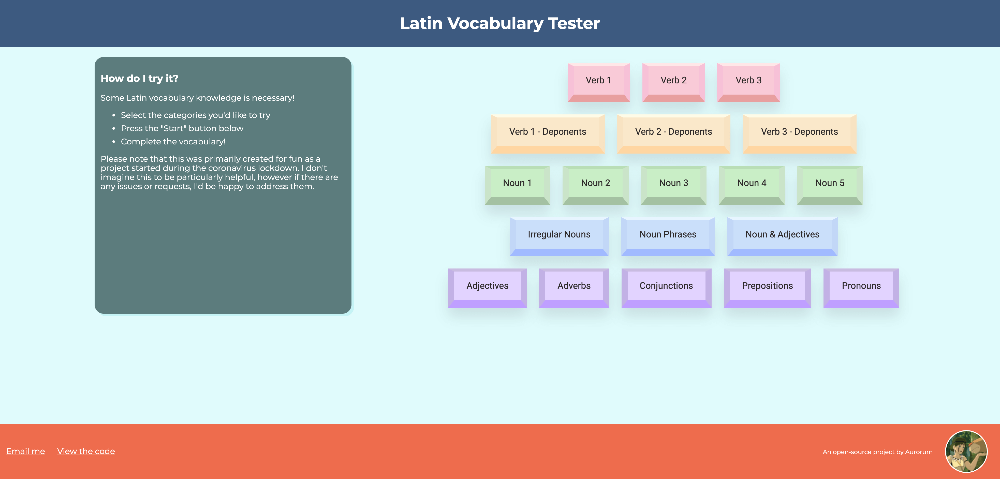

# Latin Vocabulary Tester
Provides a way to test your knowledge of the OCR Latin vocabulary list. This was primarily created for fun and started during the coronavirus lockdown, and I'm not entirely sure how helpful it will be given that it only asks about the root meaning of a word. I couldn't find an alternative vocabulary tester online though, and if there is any desire to use it, I'm happy to ensure it functions better with more features.

