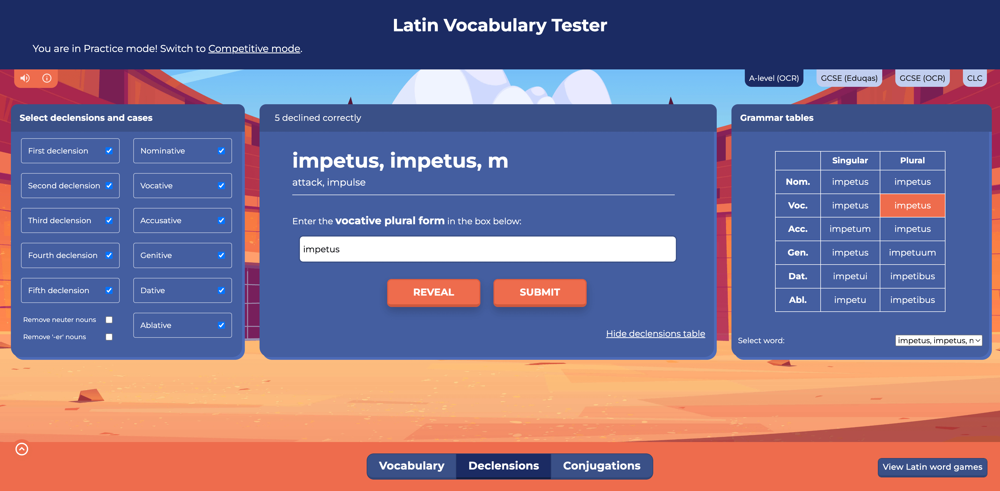
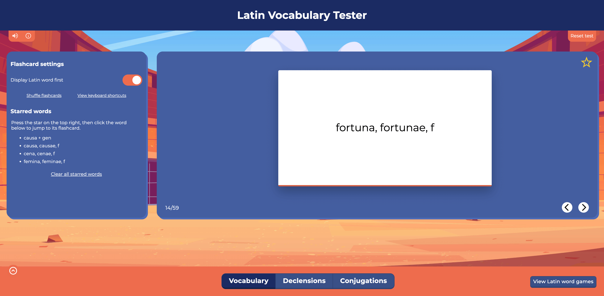
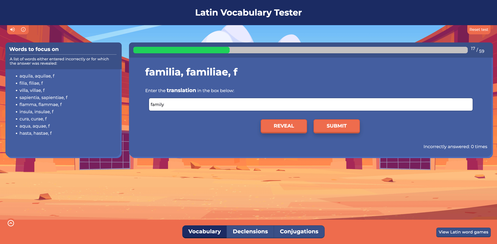
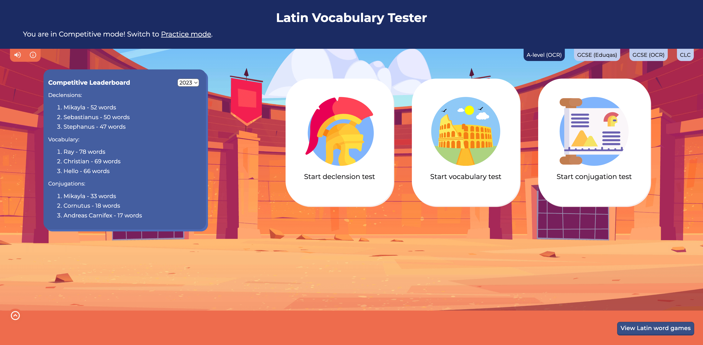
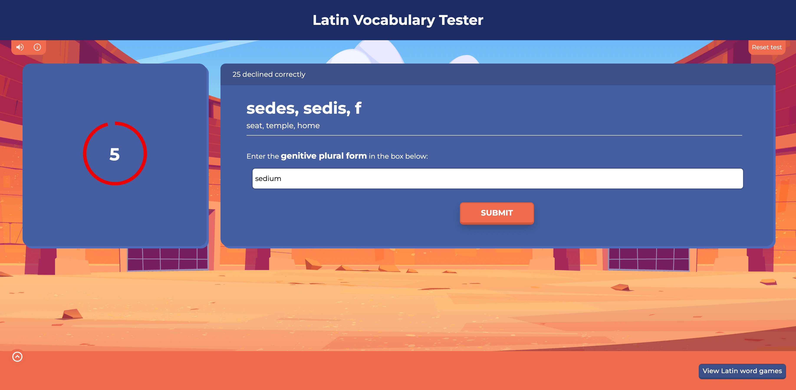

# Latin Vocabulary Tester

Provides a way to test your knowledge of Latin vocabulary lists based on different exam specifications, while also containing a Latin Noun Declension & Verb Conjugation Tester.

Link: https://latinvocabularytester.com

I mainly created this tool during the lockdown and my holidays to assist with my own learning as a Latin A-Level student. I've found it invaluable for becoming more comfortable with my vocabulary and grammar, and I hope that it will help other students too. It's brought me great joy to hear of other schools across the UK using it, and I'm always open to making changes based on feedback from others, so please get in touch if you have any!

## Features

### Noun Declension Tester

Covers the nominative, vocative, accusative, genitive, dative and ablative cases in the five declensions. While using Practice Mode, users are able to select which declensions and cases they wish to cover. The table for each noun can also be toggled to compare each word in different cases in both the singular and the plural form.

### Verb Conjugation Tester

Covers the main indicative and subjunctive verb tenses, with some other common forms such as participles and infinitives. These can either be completed in "Table Mode", which involves filling in tables based on the verb's tense, or the normal mode through which the user will be presented with the tense, mood number, and voice of a verb. The former tends to be less daunting, but the latter is excellent practice when the user is confident with their conjugations.

There are numerous features to assist users with learning these conjugations; for example, the user will be notified if they enter an incorrect form of the verb which matches another form, and they can see tables comparing the different forms of the verb. It should be noted that irregular verbs are also accurately covered with this tool.

|  |  |
| ------------------------------------------------------------------- | ------------------------------------------------------------------ |

### Vocabulary Tester

There are four different lists included with the Latin Vocabulary Tester, with the top two split into categories and the bottom two split into stages:

- AS Level list (OCR), including some common verse vocabulary from Mathew Owen's "Ovid Unseens"
- GCSE (OCR)
- GCSE (Eduqas)
- Cambridge Latin Course (Stages 1 to 40)

_Note: I would be delighted to add further lists, and it's also possible to upload custom lists which a user has created themselves. If you would be interested in this, please get in touch!_

Although there are a wide range of vocabulary testers online, there are some features which I always wished for them to contain, so I've added them to this tool. This isn't an extensive list, but they include:

- **English to Latin and vice versa**: users can opt for whether they want to attempt English to Latin, vice versa, or a combination of both. When an English to Latin question appears, the user will be asked for either the nominative or genitive singular form of nouns, or for verbs, the first-person active present/perfect or present infinitive form. In other words, the user will be asked what a Latin dictionary would typically contain for that entry.
- **CSV exports:** these can be used with a service such as Google Sheets or Excel to provide a spreadsheet of words answered incorrectly. This is particularly useful for focusing on words which a user isn't familiar with rather than learning from a longer list.
- **Focus on incorrectly answered vocabulary:** at the end of a session, users can restart the test while only answering words which they initially answered incorrectly. In addition, they can upload their CSV export (see above) to try this at a later point too.
- **Filter by starting letter:** this is particularly helpful when practising for classroom assessments, where it's common for part of a list to be covered. Individual words can also be removed from the preview modal by clicking "View selected words" underneath the Start button.

### Competitive Mode

Practice Mode is the common way that the tool is used, but Competitive Mode can also be engaging and a great way of testing your knowledge under timed pressure! This involves trying to answers as many questions as possible in two minutes, and your time ends as soon as you answer one incorrectly. There's also a Leaderboard for those who are particularly competitive! Those within the top three can opt to have their name added, subject to manual verification that ensures its an appropriate name.

|  |  |
| ------------------------------------------------------------------------------------------ | ---------------------------------------------------------------------------------------- |

## Acknowledgements

The Latin Vocabulary Tester has taken me countless hours to develop, but it wouldn't have been possible without the work of many others. Special thanks must be given to The Latin Dictionary and Latin is Simple for their excellent dictionaries, from which I was able to compile vocabulary lists. The images on the site have been designed by Flaticon. As ever, I'm very grateful to Jess (@Ep8Script) for her help whenever my code mysteriously broke. Lastly, much appreciation must be expressed for my wonderful Latin teachers at school, all of whom have inspired my enthusiasm for the subject over the years!

If you have any feedback or recommendations, please get in touch - you can reach me through the email on the site, or on Discord or Twitter. I hope that you will find the Latin Vocabulary Tester helpful and enjoy using it - _vale_! 👋🏽
